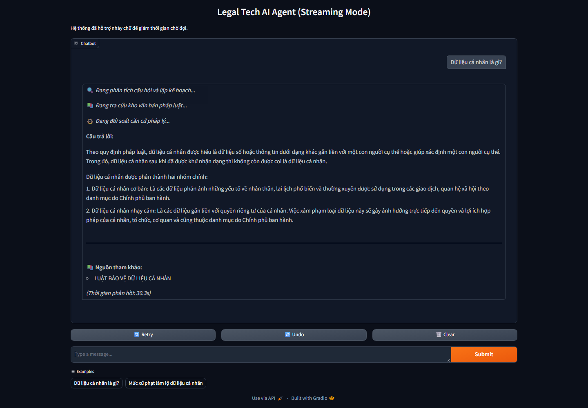
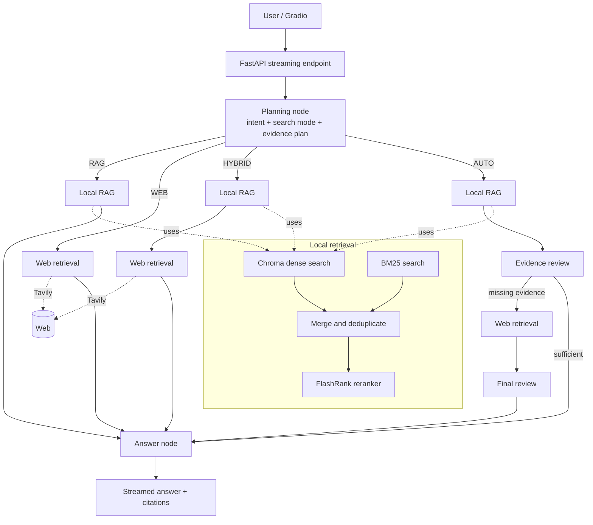

# Vietnamese Legal RAG with LangGraph Agentic Workflow

A Vietnamese legal question-answering system that plans evidence needs, retrieves from a local legal corpus, optionally supplements evidence through web search, and produces streamed answers with citations. The application combines a LangGraph single-agent workflow with hybrid Chroma/BM25 retrieval, FlashRank reranking, a Gemini model, FastAPI, and Gradio.

> This project is an information-retrieval prototype, not a substitute for professional legal advice.

## Live Demo

[Open the public demo on Hugging Face Spaces](https://huggingface.co/spaces/BPhuc/vietnamese-legal-rag-langgraph).

The public demo uses a standalone Gradio application that calls the same LangGraph/RAG core directly. The primary local architecture remains Gradio → FastAPI → LangGraph/RAG, with Docker Compose orchestrating the frontend and backend services.



Local Docker Compose interface showing a Vietnamese legal question, grounded answer, and source citation.

## Key Features

- Evidence-first agent workflow: planning identifies intent, search mode, and an evidence plan before retrieval.
- Four routing modes: `AUTO`, `RAG`, `WEB`, and `HYBRID`.
- Hybrid local retrieval using Vietnamese dense embeddings in Chroma plus BM25 lexical search.
- Candidate deduplication and CPU ONNX reranking with FlashRank.
- Evidence review in `AUTO` mode, with Tavily web search when local evidence is incomplete.
- Structured Gemini outputs for plans, reviews, final answers, and citations.
- Streaming FastAPI endpoint and conversational Gradio interface with a limited history window.
- Structure-aware PDF ingestion and persisted Chroma/BM25 indexes.

## Architecture



The graph is a single agent decomposed into reasoning nodes (planning, review, answer) and retrieval executors. The current graph sends `RAG`, `WEB`, and `HYBRID` paths directly to answer generation; evidence review controls web fallback only on the `AUTO` path.

> **Deployment note:** The diagram describes the primary local/Docker path, where Gradio calls the FastAPI streaming endpoint. The Hugging Face Space uses a standalone Gradio entry point that invokes the same LangGraph/RAG core directly, without the FastAPI hop.

## Key Evaluation Results

All reported values come from saved repository artifacts; no benchmark was rerun for this README.

| Evaluation | Main result | Interpretation |
|---|---|---|
| Structure-aware vs fixed chunking, 80 questions | Context precision `0.3341 → 0.4609`; recall `0.7075 → 0.7646` | Structure-aware chunking improved the saved RAGAS retrieval scores by `37.94%` and `8.07%` respectively. |
| Reranker configurations, top-4 | CrossEncoder: MRR `0.9278`, mean `0.4668 s/query`; FlashRank: MRR `0.7722`, mean `1.4309 s/query` | CrossEncoder was stronger and faster in this recorded run, but it used an RTX 5060 GPU while FlashRank used CPU. This is **not a hardware-equivalent comparison**. |
| Custom LLM judge, 80 questions | Answer correctness `0.8193 → 0.9361`; faithfulness `0.9975 → 0.9980` | The configured rerank pipeline improved judged correctness by `14.27%` relative, while faithfulness was nearly saturated. This evaluation is not RAGAS. |

## Tech Stack

Python 3.11, FastAPI, LangGraph, LangChain, Gemini (configured through `LLM_MODEL`), Chroma, `bkai-foundation-models/vietnamese-bi-encoder`, BM25, FlashRank (`ms-marco-MultiBERT-L-12`), Tavily, Gradio, pytest, Docker, and Docker Compose.

## How It Works

1. The planning node classifies the request and creates one or more retrieval queries grouped by evidence topic.
2. Local retrieval runs dense and sparse search, merges duplicate chunks, and reranks the candidate set.
3. Depending on the selected mode, the workflow may use only the knowledge base, only Tavily, both sources, or review local evidence before deciding whether web evidence is needed.
4. The answer node synthesizes only the collected evidence into a structured answer and citation list.
5. FastAPI streams workflow status, answer text, citations, and processing time to Gradio.

## Quick Start

Python 3.11 is recommended. Existing indexes under `vector_store/` are required unless you explicitly rebuild them.

```powershell
python -m venv .venv
.\.venv\Scripts\Activate.ps1
pip install -r requirements.txt
Copy-Item .env.example .env
```

Set `GOOGLE_API_KEY` and `TAVILY_API_KEY` in `.env` without committing the file. The example already contains the required model, retrieval, chunking, path, and logging settings.

Run the services in separate terminals:

```powershell
uvicorn app.main:app --reload --port 8000
python app/gradio_app.py
```

Open `http://localhost:7860`. API documentation is available at `http://localhost:8000/docs`.

## Docker

Docker Compose is the preferred reproducible local path:

```powershell
docker compose up --build
```

The backend is exposed on port `8000` and mounts `app/`, `data/`, and `vector_store/`. The frontend is exposed on port `7860` and reaches the backend by Docker service name. Model caches are retained in named volumes. `.env` is supplied at runtime and excluded from the images.

Stop the stack with:

```powershell
docker compose down
```

## Project Structure

```text
app/
├── api/            FastAPI routes and dependencies
├── graph/          LangGraph workflow, routing, and nodes
├── ingestion/      PDF loading, structure detection, chunking, indexing
├── prompts/        Planning, review, and answer prompts
├── retrieval/      Chroma, BM25, hybrid retrieval, reranking, web search
├── schemas/        Pydantic request and structured-output models
└── state/          Shared agent state
benchmark/          Chunking, reranker, top-k, and answer evaluations
data/               Local legal documents and evaluation dataset
docs/               Design notes and demo assets
tests/              Focused pytest tests
vector_store/       Persisted Chroma and BM25 indexes
```

## Benchmark Details

### Chunking retrieval evaluation

**Goal:** compare fixed recursive chunks (`1000` characters, `150` overlap) with the project's metadata/structure-aware chunks on the same 80-question dataset. **Result:** RAGAS context precision increased from `0.3341` to `0.4609`, and context recall from `0.7075` to `0.7646`. **Observation:** legal-document structure improved both metrics, especially precision. **Limitations:** the metrics are LLM-assisted RAGAS scores on one local corpus; answer quality, latency, and statistical uncertainty were not measured.

### CrossEncoder and FlashRank configurations

**Goal:** rerank identical saved candidate pools for 80 queries (664 candidates total) at top-4. `BAAI/bge-reranker-v2-m3` used `sentence-transformers`/PyTorch on CUDA; `ms-marco-MultiBERT-L-12` used FlashRank/ONNX Runtime on CPU. **Result:** CrossEncoder achieved hit rate `0.96`, expected-document recall `0.9133`, MRR `0.9278`, and binary nDCG `0.8555`; FlashRank achieved `0.92`, `0.88`, `0.7722`, and `0.6724`. Mean latency was `0.4668 s` versus `1.4309 s`. **Observation:** the complete CrossEncoder configuration led this run. **Limitations:** different models, backends, and devices mean latency is not hardware-equivalent and results cannot be attributed to the frameworks alone. Relevance is mostly document-level proxy matching; only 75 questions had usable labels.

### FlashRank top-k sensitivity

**Goal:** compare top-4, top-5, and top-6 from one complete FlashRank ranking. **Result:** expected-document recall rose `0.8800 → 0.8911 → 0.9111`, while evidence coverage rose `0.3851 → 0.4851 → 0.5667`. **Observation:** top-6 recovered more evidence with 50% more chunks than top-4. **Limitations:** downstream token cost and generated-answer quality were not measured; evidence coverage uses normalized exact containment rather than semantic equivalence.

### Custom LLM-judge answer evaluation

**Goal:** compare answers generated from the first four retrieved candidates against answers generated after the configured reranker. **Result:** the custom Gemini judge scored correctness at `0.8193` without reranking and `0.9361` with reranking; faithfulness was `0.9975` and `0.9980`. Historical rerank timing averaged `11.448 s/query` across 80 questions. **Observation:** the saved run indicates a correctness gain, not a meaningful faithfulness change. **Limitations:** this is a repository-specific Gemini judge, not RAGAS; there is no human adjudication, judge scores are highly saturated, and the artifact does not record a complete execution environment.

## Data & Privacy

Source PDFs, test data, indexes, `.env`, and detailed benchmark artifacts are ignored by Git where configured. Docker mounts local data instead of copying it into images. Nevertheless, Gemini receives model prompts and Tavily may receive search queries when web retrieval is selected. Review provider policies before using confidential material, minimize personal data, rotate exposed credentials, and never commit `.env`.

## Limitations

- The corpus is limited to the documents placed in `data/raw`; answers can be incomplete or outdated.
- Generated legal information may contain interpretation errors and requires expert verification.
- Citation granularity is currently document-level and local citations may not have a URL.
- The API and Gradio app do not implement authentication or authorization.
- Several legacy benchmark scripts contain machine-specific absolute paths, reducing portability.
- Local installation and the frontend Docker image currently pin different Gradio versions; validate both paths when changing the UI dependency.

## Future Work

- Add human-reviewed legal relevance and answer-quality evaluation with confidence intervals.
- Improve citation granularity to article, clause, page, and highlighted evidence spans.
- Make benchmark paths fully project-relative and store reproducible environment metadata.
- Add authentication, rate limiting, audit logging, and prompt-injection defenses.
- Add end-to-end observability and latency tracing across planning, retrieval, reranking, web fallback, and answer generation.
